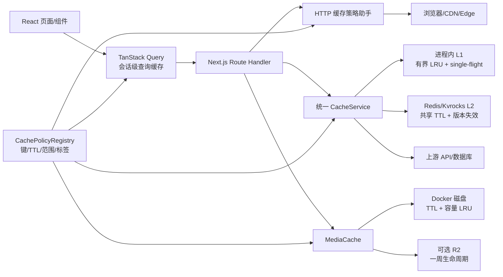

# Dong Media 缓存统一管理重构计划

> 文档状态：待实施  
> 编写日期：2026-07-29  
> 适用范围：Next.js 前端、Route Handler、Redis/Kvrocks、Docker 本地磁盘、CDN/Cloudflare Worker/R2 及浏览器缓存

## 1. 重构目标

本次重构的目标不是简单地给更多接口加上 `Cache-Control`，而是建立一套可以统一定义、读取、失效、观测和测试的缓存体系，解决当前“同一份数据多层重复缓存、TTL 分散、写后失效不完整、缓存范围不安全、部分高成本数据未缓存”的问题。

最终应达到以下结果：

1. 所有业务缓存策略都在一个策略注册表中声明，业务代码不再散落秒数、缓存键前缀和响应头字符串。
2. 明确区分浏览器缓存、TanStack Query、服务端进程内缓存、Redis/Kvrocks、磁盘缓存和 CDN/Edge 缓存的职责。
3. 同一业务数据使用统一的命名空间、版本、TTL、标签和失效流程。
4. 用户私有数据和鉴权相关响应不得进入共享缓存；公开数据才允许使用 CDN 共享缓存。
5. 静态图片和静态视频使用一周长缓存，即 `604800` 秒；失败响应、鉴权媒体、直播清单不能套用此规则。
6. 配置、数据源、直播源等发生写操作后，可以精确失效相关缓存，不再依赖重启进程或等待长 TTL。
7. 缓存击穿、雪崩、键爆炸、磁盘无限增长、跨用户污染和不可观测等问题都有统一处理方式。
8. Redis 不可用或项目运行在 `localstorage` 模式时，系统仍能正确工作，只是降级为进程内/浏览器/HTTP 缓存，不把缓存可用性变成业务可用性的前提。

## 2. 范围与概念边界

### 2.1 本计划中的“缓存”

- 可由源数据重新生成、允许按 TTL 淘汰的数据。
- 例如豆瓣/TMDB 数据、搜索结果、发布日历、直播频道解析结果、图片代理文件、React Query 查询结果。

### 2.2 不应被当作缓存的数据

- 用户设置：主题、播放器选项、自动跳过选项、下载设置等。它们是持久化偏好，不应被“清理全部缓存”删除。
- `localstorage` 存储模式下的播放记录、收藏、搜索历史和跳过配置。此时浏览器数据就是主存储，不是缓存副本。
- 登录会话、OIDC 状态、权限信息、限流计数等安全或协调状态。它们可以使用 Redis，但不能复用普通缓存的容错、失效和清理语义。
- 下载中的流、临时文件和 Service Worker 的 `urlDataMap`。这是短生命周期的传输状态，不进入业务缓存管理器。

这一边界必须落实到管理后台：“清理缓存”不能误删用户偏好或 `localstorage` 模式的主数据。

## 3. 当前实现盘点

### 3.1 已存在的缓存层

| 层级                      | 当前实现                                                 | 主要用途                           | 当前问题                                                                                 |
| ------------------------- | -------------------------------------------------------- | ---------------------------------- | ---------------------------------------------------------------------------------------- |
| 浏览器请求缓存            | 各 Route Handler 手写 `Cache-Control`                    | 豆瓣、短剧、搜索、图片、视频等     | 策略分散；部分已登录接口错误使用 `public`；浏览器 TTL 与 CDN TTL 未区分                  |
| TanStack Query            | `src/lib/get-query-client.ts`、页面组件                  | 收藏、播放记录、用户信息           | 默认 5 分钟 `staleTime`、10 分钟 `gcTime`，又与 `db.client.ts` 的缓存叠加                |
| 浏览器业务缓存            | `src/lib/cache.ts`                                       | 豆瓣、TMDB、短剧、网盘、弹幕等     | 通过运行时全局变量桥接服务端；键、类型和 TTL 缺少强约束                                  |
| 浏览器内存 + localStorage | `src/lib/unified-cache.ts`、`src/hooks/useCachedData.ts` | 通用 Hook 缓存                     | 当前没有实际业务调用方，和现有缓存体系重复，可删除                                       |
| 用户数据混合缓存          | `src/lib/db.client.ts`                                   | 播放记录、收藏、搜索历史、跳过配置 | 与 TanStack Query 重复；缓存版本、TTL 和事件失效散落；不同存储模式行为差异大             |
| 更新检查缓存              | `src/lib/watching-updates.ts`                            | 追剧更新状态                       | 自建内存/localStorage 缓存和事件系统，TTL 与页面清理逻辑不一致                           |
| 服务端通用缓存            | `src/lib/server-cache.ts`、`src/lib/redis-base.db.ts`    | Redis/Kvrocks `cache:*`            | 接口只有 get/set/delete；缺少标签、命名空间版本、单飞、负缓存和观测                      |
| 发布日历缓存              | `src/lib/calendar-cache.ts`                              | Redis 中完整日历，8 小时           | 绕过通用缓存接口，手写两个永久键和时间戳；在 `localstorage` 模式下完全不缓存             |
| 直播缓存                  | `src/lib/live.ts`                                        | 频道与 EPG 解析结果                | 进程内对象没有 TTL/容量限制；多实例不共享；只能按源手动删除                              |
| HLS key 缓存              | `src/app/api/proxy/key/route.ts`                         | 解密 key，5 分钟                   | 独立 `Map`；单实例；最多 200 项的淘汰逻辑不是真正 LRU                                    |
| 图片磁盘缓存              | `src/app/api/image-proxy/route.ts`                       | `/app/cache/image`                 | 文件永久保留，无 TTL、容量、LRU 和元数据索引；只根据扩展名推测 Content-Type              |
| 视频磁盘缓存              | `src/app/api/video-proxy/route.ts`                       | 轮播视频 `/app/cache/video`        | 使用 URL basename，可能冲突；文件永久保留；仅限制单文件 10 MB，不限制总容量              |
| Next/Vercel 静态缓存      | `vercel.json`、Next 默认静态资源策略                     | 当前仅显式配置一个字体             | 图片/视频静态资源没有统一声明；不同部署平台行为可能不一致                                |
| Edge + R2                 | `scripts/worker.js`                                      | 代理图片、视频和扩展名静态资源     | Edge 返回一周缓存，但 R2 实际永久保存；删除 `Vary`；范围过宽；签名参数导致碎片或鉴权风险 |
| Service Worker            | `public/sw.js`                                           | 流式下载                           | 不负责离线缓存，保持独立，不应纳入普通 Cache Storage 策略                                |

### 3.2 已确认的高优先级问题

#### P0：缓存范围与鉴权不匹配

- `/api/sources`、`/api/search`、`/api/search/one`、`/api/search/suggestions` 等响应依赖当前用户的可用数据源或权限，却返回 `public` 缓存头。共享 CDN 可能把一个用户的响应返回给另一个用户。
- `src/app/api/cache/route.ts` 暴露任意 key 的读取、写入和按前缀删除能力，当前没有鉴权和策略白名单。统一缓存后应移除这个通用外部 CRUD 入口；确需保留时只能作为 owner 管理接口，并限制在注册过的命名空间内。
- Cloudflare Worker 不能只按路径/扩展名判断是否缓存。带 `Cookie`、`Authorization`、签名参数或 `private/no-store` 的响应必须旁路共享缓存。

#### P0：静态媒体“响应缓存一周”和“源站文件永久缓存”语义冲突

- 图片代理已经返回 `max-age=604800`，但 `/app/cache/image` 中的文件没有过期逻辑。浏览器一周后回源仍会拿到同一个永久旧文件。
- 轮播视频本地文件也永久存在，而且文件名只取 URL basename，不同主机或路径可能互相覆盖。
- `scripts/worker.js` 给 Edge 响应设置一周 TTL，但 R2 对象没有到期清理，因此 R2 是永久缓存。
- 非轮播视频仍使用可配置的 `SiteInterfaceCacheTime`，没有落实图片/静态视频统一一周策略。

#### P1：策略、注释和实际值不一致

`src/lib/cache.ts` 中已有多处注释与数值不一致，例如：

- `details` 实际为 7 天，注释写 4 小时。
- `lists` 实际为 4 小时，注释写 2 小时。
- `comments` 实际为 7 天，注释写 1 小时。
- YouTube 搜索实际为 30 分钟，注释写 60 分钟。

这说明 TTL 不能继续依靠分散常量和行内注释维护。

#### P1：多套客户端缓存重叠

- 收藏和播放记录同时经过 TanStack Query 与 `HybridCacheManager`。
- `db.client.ts` 又维护 pending promise、同步节流、CustomEvent 和 localStorage/Map 缓存。
- `unified-cache.ts` 与 `useCachedData.ts` 是第三套客户端方案，但当前没有业务使用方。
- 同一个写操作需要人工同步多个缓存和事件，很容易出现一个页面更新、另一个页面仍显示旧值的情况。

#### P1：失效能力不足

- 配置读取为了保证新鲜度，在 `loadConfig()` 中每次调用 `unstable_noStore()` 并访问数据库，避开了缓存，却增加了所有请求的数据库开销。
- 管理配置更新主要依赖 `revalidatePath('/', 'layout')`，它不能自动清除 Redis 业务键、客户端 Query Cache、直播内存缓存、磁盘媒体和 Edge/R2。
- Redis 清理使用 `KEYS cache:*` 或按前缀 `KEYS`，数据量增大后会阻塞 Redis；“已清理数量”目前经常只是返回 `1`，不是真实统计。
- 发布日历绕过 Redis TTL，依靠单独时间键判断过期；旧数据不会由 Redis TTL 自然淘汰。

#### P1：缺少防击穿和降级策略

- 热门搜索、豆瓣详情、直播源解析等在 TTL 同时到期时，可能由多个请求并发回源。
- 多数调用只有简单的 cache-aside，没有进程内 single-flight、分布式锁、TTL 抖动或 stale-if-error。
- 空结果和上游失败的缓存方式不统一：有的完全不缓存，有的把空结果按正常 TTL 缓存，有的手写失败缓存。

### 3.3 建议新增缓存的数据

以下对象具备“读取频繁、生成或上游请求成本高、允许短暂陈旧”的特点，应纳入统一策略：

| 数据                                        | 当前状态                           | 建议                                                                     |
| ------------------------------------------- | ---------------------------------- | ------------------------------------------------------------------------ |
| 经过脱敏的公开运行配置 `/api/server-config` | 每次调用 `loadConfig()`            | 公开投影缓存 60 秒，配置写入后立即失效                                   |
| 完整后台配置的服务端读取                    | 每次访问数据库并自检               | L1 30 秒 + 共享缓存 60 秒；任何后台写操作增加配置版本并失效              |
| 直播频道与 EPG 解析                         | 无 TTL 的单进程对象                | L1 + Redis；频道 10 分钟、EPG 15 分钟；支持手动刷新和 stale-if-error     |
| Bing 每日壁纸                               | 每次请求上游且主动 `no-store`      | 成功结果 6 小时，失败 1 分钟；图片本体仍按静态图片一周缓存               |
| ACG 搜索                                    | 无业务缓存                         | 查询结果 15 分钟，空结果 2 分钟                                          |
| 弹幕 API 的最终标准化结果                   | 前端缓存为主                       | 移到服务端共享缓存 24 小时，前端只用 Query Cache，避免每个浏览器重复加工 |
| 网盘搜索                                    | 客户端和接口职责混杂               | 服务端按规范化 query 缓存 30 分钟，前端不再另存一份业务缓存              |
| 搜索建议                                    | 只依靠 HTTP 共享缓存且依赖用户权限 | 服务端按用户权限版本/源集合缓存 5 分钟，HTTP 改为私有或 `no-store`       |
| 上游失败/空结果                             | 各处行为不同                       | 按策略设置 30 秒至 5 分钟负缓存，绝不缓存 401/403/429                    |

## 4. 目标架构



### 4.1 单一策略注册表

建议先创建 `src/lib/cache-system/`，避免与现有 `src/lib/cache.ts` 冲突。全部调用迁移后，再删除旧文件并视需要改名为 `src/lib/cache/`。

建议结构：

```text
src/lib/cache-system/
├── policies.ts          # 唯一的业务策略注册表
├── keys.ts              # 稳定序列化、规范化与 key 构建
├── types.ts             # CachePolicy、CacheEntry、CacheResult
├── server.ts            # CacheService/getOrLoad/invalidate
├── http.ts              # public/private/no-store/media 响应头助手
├── metrics.ts           # 命中、未命中、延迟、大小、错误统计
├── adapters/
│   ├── memory.ts        # 有界 LRU
│   └── redis.ts         # Redis/Kvrocks 适配器
└── media/
    ├── disk.ts          # 磁盘文件、元数据、配额和清理
    └── policy.ts        # 图片/视频、Range、Content-Type 规则
```

策略类型至少包含：

```ts
type CacheScope = 'public' | 'user' | 'system';

interface CachePolicy {
  namespace: string;
  version: number;
  scope: CacheScope;
  freshTtlSeconds: number;
  staleTtlSeconds?: number;
  negativeTtlSeconds?: number;
  jitterRatio?: number;
  layers: Array<'memory' | 'shared' | 'browser' | 'cdn' | 'disk' | 'r2'>;
  maxEntryBytes?: number;
  tags: string[];
  cacheErrors?: false;
}
```

业务代码只引用策略名，不直接写秒数。例如：

```ts
await cacheService.getOrLoad(
  CACHE_POLICIES.DOUBAN_DETAILS,
  { id, locale: 'zh-CN' },
  () => fetchDoubanDetails(id),
);
```

### 4.2 统一缓存键

建议格式：

```text
dm:v2:<environment>:<namespace>:<policy-version>:<scope-hash>:<params-hash>
```

约束如下：

- 参数先进行稳定排序和业务规范化，再使用 SHA-256 摘要，避免顺序不同产生重复键。
- query 应 trim，并在业务允许时统一大小写；分页、语言、地区、数据源、过滤条件必须进入键。
- 用户级缓存使用不可逆的用户/权限范围摘要，Redis 键中不出现明文用户名、Cookie、token、签名或完整媒体 URL。
- 依赖配置的数据必须包含“配置版本”或“数据源版本”，配置更新后通过版本递增自然切换到新键。
- 图片和视频磁盘键使用完整规范化源 URL、媒体类型和变体的摘要，不能再使用 basename。
- Redis 前缀只能由 adapter 添加一次，避免业务键与当前 `cache:` 前缀互相嵌套。

缓存值使用统一 envelope：

```ts
interface CacheEntry<T> {
  schemaVersion: number;
  value: T;
  createdAt: number;
  freshUntil: number;
  staleUntil: number;
  sourceVersion?: string;
  contentType?: string;
  etag?: string;
}
```

Redis 仍以原生 TTL 作为最终清理机制，envelope 时间用于 stale-while-revalidate、调试和跨层一致性判断。

### 4.3 各层职责

#### TanStack Query

- 只负责浏览器会话内的服务端数据查询状态、请求去重和 UI 刷新。
- 播放记录、收藏、搜索历史、跳过配置、用户统计统一以 Query Key 管理。
- 写操作成功后使用 `setQueryData` 或 `invalidateQueries`；不再同时手工改 Query Cache、`HybridCacheManager` 和多个 CustomEvent。
- 默认不把所有 Query Cache 持久化到 localStorage。仅当产品明确需要离线或跨刷新保留时，对允许的 query 做白名单持久化。
- `localstorage` 主存储模式仍直接读取本地主数据，但通过相同 repository/query 接口暴露给 UI。

#### 进程内 L1

- 使用有界 LRU，按条目数和估算字节数双重限制，不再使用无限增长的对象或 `Map`。
- TTL 通常短于 L2，例如 L2 为 4 小时，L1 可为 30 至 120 秒。
- 提供 single-flight，同一个 key 在同一进程中只有一个 loader 回源。
- 只作为性能层；进程重启或多实例不一致不能影响正确性。

#### Redis/Kvrocks L2

- 负责跨进程共享的公开/系统级可再生数据。
- 所有写入必须带 TTL，禁止业务缓存永久键。
- 使用 namespace generation 或 tag generation 做 O(1) 逻辑失效，旧键由 TTL 自然淘汰。
- 管理后台扫描统计使用 `SCAN`，禁止 `KEYS cache:*`。
- 分布式热门 key 可选 `SET NX PX` 短锁；取锁失败时优先返回 stale 数据，而不是所有请求同时回源。
- Redis 故障时 fail-open 到 loader/L1，并记录指标；不能让非关键缓存故障直接导致接口 500。

#### HTTP/浏览器/CDN

- HTTP 缓存和服务端数据缓存是两个独立层，不能因为 Redis TTL 是 4 小时就机械地让浏览器也缓存 4 小时。
- 公开且对所有用户完全相同的数据可使用 `public, max-age=0, s-maxage=<ttl>, stale-while-revalidate=<ttl>`，让浏览器重验证、CDN 共享。
- 依赖用户、角色、成人内容权限、可见数据源或 Cookie 的响应使用 `private, no-store`；如确有收益，可评估短 `private, max-age`，但不得使用 `s-maxage`。
- 登录、注册、会话、管理、用户主数据、解析地址等接口统一 `private, no-store, max-age=0`。
- 401、403、429、5xx、缓存预热中的 503 一律 `no-store`。
- 不使用自定义的多个 CDN 头互相覆盖。由 `http.ts` 为不同平台生成一套经过测试的头。

#### 磁盘/R2 媒体缓存

- 只缓存校验通过的成功 `200` 完整媒体响应；Range `206` 默认不落盘为独立文件。
- 文件和元数据原子写入，先写临时文件，再 rename；并发下载通过 single-flight 合并。
- 元数据记录源 URL 摘要、Content-Type、大小、ETag、Last-Modified、创建时间、最后访问时间和到期时间。
- 设置总容量高/低水位并按 LRU 清理，例如达到上限后清理到 80%；具体容量通过部署配置确定。
- 启动时和低频定时任务清理过期/损坏/孤儿临时文件。
- Docker 可使用 `/app/cache`；Vercel 等临时文件系统自动禁用磁盘层，依赖 CDN/R2，不把硬编码路径当作所有平台都可写。
- R2 对象写入 `expiresAt` 元数据，并通过生命周期规则或定时清理在一周后删除，不能永久增长。

## 5. 建议缓存策略矩阵

下表是第一版基线。实施时只能在 `policies.ts` 修改，不能在调用点覆盖魔法数字。

### 5.1 公开/共享业务数据

| 策略                                   |                      建议新鲜 TTL |              stale/失败兜底 | 层级          | 失效事件               |
| -------------------------------------- | --------------------------------: | --------------------------: | ------------- | ---------------------- |
| `config.server` 完整服务端配置         |                             60 秒 |                stale 5 分钟 | L1 + L2       | 任意后台配置写入       |
| `config.public` 脱敏公开配置           |                             60 秒 |                stale 5 分钟 | L1 + L2 + CDN | 站点/OIDC/下载配置写入 |
| `douban.details`（不含短命预告片 URL） |                              7 天 |    stale 1 天；失败 30 分钟 | L1 + L2 + CDN | 精确刷新、数据模型升级 |
| `douban.trailer`                       | 4 小时，上限不超过上游 URL 有效期 |                 失败 5 分钟 | L1 + L2       | 403、手动刷新          |
| `douban.list/categories/recommends`    |                            4 小时 |   stale 1 小时；失败 2 分钟 | L1 + L2 + CDN | 手动刷新、策略版本升级 |
| `douban.comments`                      |                            1 小时 |               stale 30 分钟 | L1 + L2 + CDN | 策略版本升级           |
| `douban.top250`                        |                           24 小时 |                stale 6 小时 | L1 + L2 + CDN | 手动刷新               |
| `tmdb.actor-search`                    |                            6 小时 | stale 1 小时；空结果 5 分钟 | L1 + L2       | TMDB 配置/语言变化     |
| `tmdb.details/credits`                 |                     12 至 24 小时 |                stale 6 小时 | L1 + L2       | TMDB 配置/语言变化     |
| `shortdrama.recommends`                |                            1 小时 |               stale 30 分钟 | L1 + L2 + CDN | 短剧配置写入           |
| `shortdrama.list`                      |           2 小时；第一页可 4 小时 |               stale 30 分钟 | L1 + L2 + CDN | 短剧配置写入           |
| `shortdrama.categories`                |                            4 小时 |                stale 1 小时 | L1 + L2 + CDN | 短剧配置写入           |
| `youtube.search`                       |                           30 分钟 |              空/失败 5 分钟 | L1 + L2       | YouTube 配置写入       |
| `netdisk.search`                       |                           30 分钟 |               空结果 2 分钟 | L1 + L2       | 网盘配置写入           |
| `danmu.normalized`                     |                           24 小时 | stale 6 小时；空结果 5 分钟 | L1 + L2       | 单集强制刷新           |
| `release-calendar`                     |                            8 小时 |                stale 8 小时 | L1 + L2       | cron/手动刷新          |
| `bing-wallpaper.meta`                  |                            6 小时 |  stale 24 小时；失败 1 分钟 | L1 + L2 + CDN | 日期变化/手动刷新      |
| `acg.search`                           |                           15 分钟 |               空结果 2 分钟 | L1 + L2       | 无，按 TTL             |
| `live.channels`                        |                           10 分钟 |               stale 30 分钟 | L1 + L2       | 直播源编辑/手动刷新    |
| `live.epg`                             |                           15 分钟 |               stale 60 分钟 | L1 + L2       | 直播源编辑/手动刷新    |
| `spider.jar` 元数据/内容               |                           24 小时 |               stale 24 小时 | L1/文件       | JAR 强制更新           |

说明：豆瓣详情与预告片 URL 必须拆开。当前把可能短期失效的 trailer URL 混入长 TTL 详情响应，会迫使整个详情降低 TTL，或导致长时间返回已失效 URL。

### 5.2 用户范围数据

| 数据                               | 服务端/HTTP 策略                                     | 浏览器策略                                 | 写后处理                                                   |
| ---------------------------------- | ---------------------------------------------------- | ------------------------------------------ | ---------------------------------------------------------- |
| 播放记录                           | `private, no-store`                                  | Query `staleTime` 5 分钟；本次写入立即更新 | `setQueryData(['playRecords', userScope])`，必要时重新校验 |
| 收藏                               | `private, no-store`                                  | Query `staleTime` 5 分钟                   | 乐观更新，失败回滚，随后 invalidate                        |
| 搜索历史                           | `private, no-store`                                  | Query `staleTime` 1 至 5 分钟              | 写入后立即更新同一 Query Key                               |
| 跳过配置                           | `private, no-store`                                  | Query `staleTime` 5 分钟                   | 精确更新当前 source/id 与列表 query                        |
| 用户统计                           | `private, no-store`                                  | Query `staleTime` 5 分钟                   | 播放统计写入后失效                                         |
| 追剧更新计算结果                   | `private, no-store`                                  | Query/内存 5 分钟                          | 播放记录变化时失效                                         |
| 用户可用数据源、聚合搜索和搜索建议 | HTTP `private, no-store`；服务端可按权限版本做短缓存 | Query 1 至 5 分钟                          | 用户权限或数据源配置变化时失效                             |

`localstorage` 主存储模式下，上述数据仍可落 localStorage，但应由一个 `UserDataRepository` 管理，不经过“清理公共业务缓存”的流程。

### 5.3 静态图片和视频：统一一周

静态图片和静态视频统一使用：

```http
Cache-Control: public, max-age=604800, s-maxage=604800
```

具体规则：

| 资源                                 |                TTL | `immutable`                 | 备注                                                                 |
| ------------------------------------ | -----------------: | --------------------------- | -------------------------------------------------------------------- |
| 内容哈希文件名的图片/视频            |               7 天 | 可以                        | URL 改变即代表内容改变                                               |
| `public/` 下固定 URL 图片/视频       |               7 天 | 不使用                      | 一周后通过 ETag/Last-Modified 重验证，避免部署同名新文件后永远不更新 |
| `/api/image-proxy` 成功图片          |               7 天 | 仅当 key/URL 内容寻址时使用 | 磁盘和 R2 也必须一周到期                                             |
| `/api/video-proxy` 成功静态 MP4/WebM |               7 天 | 仅当内容寻址时使用          | HEAD、GET、Range 的验证器必须一致                                    |
| Next `_next/static` 构建产物         | 保留 Next 默认策略 | 是                          | 已由构建 hash 保证，不需要覆盖为更短策略                             |
| 错误、预热 503、超时、上游 4xx/5xx   |                  0 | 否                          | `no-store`                                                           |

“静态视频一周”不包括以下内容：

- 直播 M3U8 清单：`private, no-store` 或极短 TTL。
- 会不断追加分片的活动直播流。
- 需要 Cookie/Authorization 的媒体。
- 仅凭短期签名 URL 才有权访问的媒体。共享缓存必须在每次命中前完成签名/权限校验，否则只能使用私有缓存。
- 上游短时有效的解析地址或预告片跳转 URL；其元数据 TTL 不得超过 URL 实际有效期。

对于 VOD HLS，只有在分片 URL 内容不可变、权限模型允许、缓存键已去除无意义签名碎片且命中前仍校验访问权限时，才可单独把分片提升为一周缓存。播放清单仍使用短 TTL。

## 6. HTTP 缓存统一方案

在 `src/lib/cache-system/http.ts` 提供固定助手，Route Handler 禁止自行拼接头：

- `noStoreResponseHeaders()`：登录、用户数据、管理接口、错误响应。
- `privateResponseHeaders(seconds?)`：确实允许当前浏览器短缓存但不允许 CDN 共享的数据。
- `publicApiResponseHeaders(policy)`：公开 JSON，浏览器重验证、CDN 按策略缓存。
- `staticMediaResponseHeaders({ contentAddressed })`：成功静态图片/视频固定一周。
- `conditionalResponseHeaders(metadata)`：统一 ETag、Last-Modified、304。

首批必须修正的接口：

1. `/api/sources`、`/api/search`、`/api/search/one`、`/api/search/suggestions` 从 `public` 改为 `private, no-store`，除非后续证明响应完全不依赖用户并重构成独立公开接口。
2. `/api/playrecords`、`/api/favorites`、`/api/searchhistory`、`/api/skipconfigs`、`/api/episode-skip-config`、`/api/user/*` 全部分支（含错误分支）显式 `private, no-store`。
3. `/api/admin/*`、登录/注册/OIDC/session/logout、解析接口全部使用 `private, no-store`。
4. 只有豆瓣/TMDB/短剧等真正公开、参数完整决定内容的接口可以使用共享 CDN 缓存。
5. 成功与失败分支必须分别设置缓存头，不能让 CDN 缓存暂时性的空数据或错误页面。
6. 保留必要的 `Vary`，尤其是内容编码和表示形式；Cloudflare Worker 不再无条件删除 `Vary`。

## 7. 失效模型

### 7.1 标签与版本

每个策略有 namespace/version，每个可变配置域有 generation：

```text
dm:gen:config
dm:gen:sources
dm:gen:live:<source-hash>
dm:gen:user-permissions:<user-scope-hash>
```

缓存键包含 generation。清理整个命名空间时执行原子 `INCR`，新请求立即切换到新 generation；旧键依赖 TTL 自动删除。这样无需在请求路径执行 Redis `KEYS`。

精确对象仍可直接删除，例如刷新某个豆瓣 ID、某个直播源或某一集弹幕。

### 7.2 写操作到失效标签的映射

| 写操作                          | 必须失效                                                                                           |
| ------------------------------- | -------------------------------------------------------------------------------------------------- |
| 站点配置更新                    | `config.server`、`config.public`、相关 Next 页面；如果影响缓存时长，只影响后续写入，不修改已有条目 |
| 数据源新增/禁用/删除/排序       | `config`、`sources`、`search`、`search-suggestions`，并递增 source generation                      |
| 用户组/成人内容权限变化         | 对应用户权限 generation、用户可用源、搜索/建议 Query Cache                                         |
| 直播源新增/修改/删除            | `live.sources`、该源的 channels/EPG/merged；删除对应磁盘/Edge 派生内容（如有）                     |
| 直播手动刷新                    | 精确清除该源 channels/EPG，再由 single-flight 回源                                                 |
| 豆瓣预告片 403 或手动刷新       | `douban.trailer:<id>`、对应详情投影、对应轮播视频缓存                                              |
| 短剧/网盘/YouTube 配置修改      | 对应 namespace generation                                                                          |
| 播放记录/收藏/历史/跳过配置写入 | 当前用户 Query Key 与追剧更新结果；不能清全站共享缓存                                              |
| 发布日历 cron/手动刷新          | 以新数据原子覆盖 `release-calendar`，失败时保留 stale 旧值                                         |
| 管理员“清理全部缓存”            | 增加所有业务 namespace generation；媒体磁盘/R2 单独异步清理；不删除用户偏好/主数据                 |

CDN/Edge 的立即 purge 能力依部署平台而异。对必须即时生效的动态配置，应让浏览器 `max-age=0` 且 CDN TTL 短，并在平台支持时调用 tag/path purge。不要依赖清除用户浏览器中已经缓存数小时的公开 JSON。

## 8. 一致性与抗并发策略

### 8.1 标准读取算法

`getOrLoad` 使用以下流程：

1. 校验并规范化参数，生成统一 key。
2. 查 L1：新鲜则返回；stale 则可返回并异步刷新。
3. 查 L2：新鲜则回填 L1；stale 则按策略返回并触发刷新。
4. L1 single-flight 合并同 key 请求。
5. 对极热 key 尝试短分布式锁；没有拿到锁时短暂等待一次或返回 stale。
6. 调用 loader，校验结果类型、大小和是否允许缓存。
7. 带 5% 至 10% TTL jitter 写 L2/L1，避免同批条目同时过期。
8. loader 失败时，如果 stale 仍在 `staleUntil` 内则返回 stale 并标记 `STALE`；否则按原业务错误返回。

### 8.2 负缓存

- “确实不存在”与“上游失败”使用不同结果类型，不能都用 `null`。
- 确认不存在/空结果可按 `negativeTtlSeconds` 短缓存。
- 超时和 5xx 最多使用很短的 failure marker，同时优先 stale-if-error。
- 401、403、429 永不进入业务数据缓存。403 可能代表短链接失效，应触发精确失效而不是缓存错误。

### 8.3 限流不再复用普通缓存

`src/app/api/tvbox/route.ts` 当前通过 `getCache` 后 `setCache(current + 1)` 做限流，存在并发竞态。重构时改为专用 `RateLimiter`，在 Redis 使用原子 `INCR` + 首次 `EXPIRE` 或 Lua 脚本；无 Redis 时使用有界进程内降级。限流键和缓存清理入口完全隔离。

## 9. 客户端重构方案

### 9.1 收敛到 Query + Repository

新增统一 Query Key 工厂，例如：

```ts
const userQueryKeys = {
  all: (scope: string) => ['user-data', scope] as const,
  playRecords: (scope: string) =>
    [...userQueryKeys.all(scope), 'play-records'] as const,
  favorites: (scope: string) =>
    [...userQueryKeys.all(scope), 'favorites'] as const,
  searchHistory: (scope: string) =>
    [...userQueryKeys.all(scope), 'search-history'] as const,
  skipConfigs: (scope: string) =>
    [...userQueryKeys.all(scope), 'skip-configs'] as const,
};
```

再用 `UserDataRepository` 屏蔽两种模式：

- `localstorage` 模式：repository 直接读写本地主存储。
- Redis/Kvrocks 模式：repository 调用 `private, no-store` API。

组件只使用 Query/Mutation，不自行判断存储类型或扫描 localStorage。

### 9.2 删除重复实现

- `src/lib/unified-cache.ts` 和 `src/hooks/useCachedData.ts` 当前没有业务使用方，验证构建后直接删除。
- `src/lib/db.client.ts` 分阶段瘦身：保留 repository/序列化兼容层，移除与 TanStack Query 重复的缓存、pending promise 和通用 CustomEvent。
- `watching-updates.ts` 的计算结果迁移为 Query；确需跨组件主动通知时，优先 Query Cache，不再维护第二套真假状态。
- 用户偏好的 localStorage key 保持不变，但整理到单独的 `preferences` 模块，不进入缓存统计与清理。
- 为旧 localStorage 缓存设置一次性迁移/清理清单，按明确前缀删除，禁止遍历后把无法 JSON.parse 的任意用户数据都当“坏缓存”删除。

### 9.3 写后一致性

- 收藏、播放记录等 mutation 使用乐观更新，失败回滚。
- 服务端成功后用响应中的最终对象更新 Query Cache，避免紧接着再次 GET。
- 多标签页同步可用 `BroadcastChannel`，只发送“哪个 Query Key 已变化”的小事件，不传完整大对象。
- 登出时只清当前用户的 Query Cache 和内存数据，避免下一个用户看到上一个用户的短暂缓存。

## 10. 图片、视频和 Edge/R2 专项改造

### 10.1 Next/public 静态资源

- 在 `next.config.js` 的 `headers()` 中统一声明 `public/` 下图片和视频目录的一周缓存策略。
- 建议后续把静态媒体集中放入 `public/media/`、`public/images/`、`public/videos/`，使用明确路由规则，避免按扩展名误伤动态 API。
- `logo.png`、icons、favicon 等固定 URL 使用一周但不加 `immutable`。
- 文件名带内容 hash 的构建资产可加 `immutable`；`_next/static` 保留 Next 默认处理。
- `vercel.json` 中的单独字体规则与新规则复核后保留或迁移到同一个配置来源，避免平台配置漂移。

### 10.2 图片代理

改造 `src/app/api/image-proxy/route.ts`：

- 复用现有安全 URL 校验/反 SSRF 组件，而不只是 `new URL()`。
- key 改为规范化完整 URL + 表示变体摘要。
- 保存真实上游 Content-Type，并限制允许的图片类型；拒绝把 HTML 错误页缓存成 `.jpg`。
- 磁盘元数据 `expiresAt = createdAt + 604800s`；命中已过期对象时条件回源或重新下载。
- 添加单文件上限、总目录上限、LRU 和后台清理。
- 继续支持 ETag/Last-Modified/304，但固定 URL 不错误标记 `immutable`。
- 成功响应一周，所有错误响应 `no-store`。

### 10.3 视频代理

改造 `src/app/api/video-proxy/route.ts`：

- 轮播文件名使用完整规范化 URL 或 `doubanId + resolved-url-version` 的摘要，不使用 basename。
- 成功静态 MP4/WebM 的 HTTP、磁盘、Edge TTL 都设为一周。
- 将“单文件最大 10 MB”和“缓存目录最大容量”分开配置；大文件允许纯流式转发但不落磁盘。
- 本地完整文件支持正确 Range：返回 206、`Content-Range`、`Accept-Ranges` 和对应长度；HEAD 与 GET 共享元数据。
- 只缓存完整 200，避免把某个 206 分片误当完整文件。
- 预热 503 保持 `Retry-After` 和 `no-store`；可进一步改为首请求边下载边返回，降低轮播首屏等待。
- 预告片 URL 失效时先失效 trailer 元数据和视频文件，再解析新 URL。

### 10.4 Cloudflare Worker/R2

改造 `scripts/worker.js`：

- 从“路径含代理接口或扩展名匹配”改为策略 allowlist，并校验源站响应的 `Cache-Control`、状态和 Content-Type。
- 带 Cookie/Authorization、鉴权媒体、错误响应、动态 M3U8、Range 请求默认旁路共享缓存。
- 不无条件删除 `Vary`、`Expires` 和上游验证器。
- 静态图片/视频 Edge 与 R2 一周；R2 设置生命周期清理。
- 代理 URL 的签名、过期时间等无意义参数不能造成无限键碎片；但只有在已经验证权限且不会绕过鉴权时才可使用规范化目标 URL 作为内部 key。
- 静态文件不能简单去掉全部 query；对于以 query 作为版本号但路径固定的资产，应保留受控版本参数或改为内容 hash 路径。
- 输出标准 `Cache-Status`，例如 `DongMedia; hit; ttl=...`，可临时兼容当前 `X-Cache-Source`。
- DELETE 只作为受保护的管理能力，不能成为公开清除任意对象的接口。

## 11. 管理、统计与可观测性

### 11.1 管理后台

重写 `DatabaseCacheManager` 和 `/api/admin/cache`：

- 统计按策略注册表/namespace 展示，而不是硬编码 douban/tmdb 等分支。
- 展示 L1/L2/磁盘/R2 各层的条目数、估算大小、命中率、最老/最近条目和过期数量。
- 清理返回真实结果：失效 generation、删除的精确 key 数、计划异步清理的媒体数量。
- 使用 `SCAN` 或 generation，禁止阻塞式 `KEYS`。
- “清理过期”不需要扫描 Redis 业务键；Redis TTL 自动完成物理删除。该操作主要服务磁盘、R2 和旧版 localStorage 迁移数据。
- 所有管理响应也显式 `no-store`。

### 11.2 指标与日志

每次统一缓存访问记录结构化字段，但避免记录原始搜索词、用户名和完整 URL：

- `namespace`
- `layer`: `L1` / `L2` / `DISK` / `R2` / `ORIGIN` / `BYPASS`
- `status`: `HIT` / `MISS` / `STALE` / `ERROR`
- `latencyMs`
- `entryBytes`
- `ttlRemaining`
- `loaderStatus`

建议指标：

- 各 namespace 命中率和 stale 命中率。
- Redis/上游延迟分位数。
- single-flight 合并请求数、分布式锁等待数。
- 负缓存命中数。
- 磁盘/R2 容量、淘汰数、过期清理数。
- 缓存写入失败、反序列化失败、条目过大被拒绝数。

生产日志默认不逐条打印“缓存命中成功”，避免当前大量 `console.log` 噪声；使用采样或仅在调试模式输出。

## 12. 分阶段实施计划

### 阶段 0：安全修正与基线

目标：先消除会造成跨用户污染或任意缓存操作的风险，并建立重构前基线。

- 将已登录/用户相关接口的错误 `public` 头改为 `private, no-store`。
- 移除或严格保护 `/api/cache` 的任意 CRUD。
- 为 `/api/admin/cache` 全部分支添加 `no-store`。
- 记录主要接口的当前上游请求数、P50/P95、Redis key 数和磁盘目录大小。
- 增加一份自动扫描规则：发现 authenticated route 返回 `public` 时测试失败。

完成条件：不存在已知的用户相关共享 HTTP 缓存；任意访客不能读写内部缓存。

### 阶段 1：统一基础设施

目标：引入策略注册表和 CacheService，不立刻删除旧实现。

- 新增 `cache-system` 目录、策略类型、key builder、L1 和 Redis adapter。
- 实现 `getOrLoad`、single-flight、TTL jitter、stale-if-error、负缓存和结构化结果。
- 实现 generation/tag 失效。
- 实现统一 HTTP helper。
- 为 key、TTL 边界、L1 淘汰、Redis 序列化、失效和并发去重编写单元测试。

完成条件：新模块独立通过测试，可以在无 Redis 时降级运行。

### 阶段 2：迁移公开数据与高成本上游

建议迁移顺序：

1. 豆瓣/TMDB/短剧。
2. 搜索下游、YouTube、网盘、ACG、弹幕。
3. 发布日历。
4. 配置公开投影与完整配置短缓存。
5. 直播频道/EPG。

迁移方式：先读 v2，未命中时可读一次旧 key 并回填 v2；所有新写入只写 v2。旧 Redis key 依靠原 TTL 自然过期，不做全量阻塞删除。

完成条件：上述业务不再直接调用旧 `getCache/setCache`，TTL 均来自策略表；热 key 并发测试只有一次回源。

### 阶段 3：统一客户端数据流

- 建立 Query Key 工厂、Mutation 与 `UserDataRepository`。
- 逐项迁移收藏、播放记录、搜索历史、跳过配置、用户统计和追剧更新。
- 增加多用户登出/切换隔离测试和 mutation 回滚测试。
- 删除无调用方的 `unified-cache.ts`、`useCachedData.ts`。
- 瘦身 `db.client.ts`，把用户偏好移出缓存管理。

完成条件：一个用户数据对象只有 Query Cache 这一套会话缓存；写操作不再靠多个自定义事件维持一致性。

### 阶段 4：媒体与静态资源一周缓存

- 在 Next 配置中添加静态图片/视频一周缓存规则。
- 抽取 `MediaCache`，迁移图片和视频代理。
- 增加磁盘 TTL、配额、LRU、原子写、元数据、启动清理。
- 修复视频 basename 冲突和本地 Range/HEAD。
- 更新 Worker/Edge/R2 规则与 R2 生命周期。
- 增加真实文件、条件请求、Range、过期刷新、错误不缓存和跨平台只读文件系统测试。

完成条件：成功静态图片/视频在浏览器、CDN、磁盘/R2 三处均为一周语义；不会永久占用源站/R2 空间。

### 阶段 5：管理后台与清理旧代码

- 管理后台改为读取统一 metrics/stats。
- 清理动作改为 generation/tag 失效和异步媒体清理。
- 删除 `calendar-cache.ts`、旧 `cache.ts`/`server-cache.ts` 兼容层、`database-cache.ts` 中的硬编码分支以及直播无限期对象缓存。
- 删除旧 localStorage 缓存只读兼容代码和过期迁移逻辑。
- 更新 README、部署示例和运维手册。

完成条件：全仓搜索不到业务代码手写 TTL、旧缓存前缀和未说明的 `new Map` 缓存；管理统计与实际层级一致。

## 13. 测试计划

### 13.1 单元测试

- key 参数顺序、Unicode、空值、大小写和分页生成结果稳定。
- scope 隔离：不同用户/权限版本不会生成同 key。
- TTL 在到期前、到期点和 stale 到期点行为正确，使用 fake timers，避免真实等待。
- TTL jitter 在限定范围内。
- L1 同时满足条目数和字节限制，LRU 顺序正确。
- 同 key 100 个并发请求只执行一次 loader。
- loader 失败时返回 stale，stale 过期后正确抛错。
- 负缓存不缓存 401/403/429。
- generation 增加后旧 key 不再可见。
- Redis 故障时降级，不吞掉业务 loader 的真实错误。

### 13.2 Route Handler 集成测试

- 已登录接口没有 `public`/`s-maxage`。
- 公开接口的 query、语言、分页等都进入缓存键。
- 所有错误响应为 `no-store`。
- 管理配置写入后，下一请求得到新配置和新数据源。
- 用户 A 的搜索/数据不能从用户 B 的 HTTP 或 Query Cache 命中。
- 发布日历并发刷新是原子替换，失败时保留 stale 数据。

### 13.3 媒体测试

- 静态图片与静态视频成功响应包含 `max-age=604800`。
- 固定 URL 无 `immutable`，内容 hash URL 可以有。
- ETag 与 Last-Modified 命中返回正确 304。
- 完整 GET、HEAD、单 Range、非法 Range 的状态和长度正确。
- 不同域名但同 basename 的视频不会冲突。
- 上游返回 HTML、错误 Content-Type、超大文件或中断流时不落正式缓存文件。
- 磁盘到期、容量高水位和孤儿 `.tmp` 能被清理。
- R2 对象一周后可被生命周期策略删除。
- 带 Cookie、Authorization、短期签名和直播 M3U8 不进入公开 Edge Cache。

### 13.4 验证命令

每个阶段至少运行：

```bash
pnpm typecheck
pnpm lint:strict
pnpm test
pnpm build
```

媒体和 HTTP 缓存再补充 `curl -I`、带条件头和 Range 的集成脚本，并在 Docker 与实际 CDN 环境各验证一次。

## 14. 发布、兼容与回滚

- 使用 `CACHE_V2_ENABLED` 做服务端切换；迁移初期允许按 namespace 开启，而不是一次切全站。
- 可增加短期 shadow 模式：旧缓存正常返回，新实现只记录命中差异，不把两套结果都暴露给用户。
- key 使用 `v2`，避免新旧 envelope 互相误解析。
- 迁移期采用“v2 miss -> legacy read -> v2 backfill”，不长期双写，降低一致性复杂度。
- 每个阶段可独立回滚到旧读取路径；媒体缓存上线前保留纯代理旁路开关。
- 旧 Redis 键按 TTL 自然过期；永久旧键和磁盘文件使用有范围、可审计的迁移脚本清理，禁止宽泛递归删除。
- Edge/R2 规则先灰度到测试域名，确认鉴权和 Range 无回归后再全量。

## 15. 验收标准

重构完成必须同时满足：

1. 所有业务 TTL、stale TTL、负缓存 TTL、scope 和层级都能在一个策略注册表中查到。
2. Route Handler 除统一 helper 和有注释的协议特例外，不再手写 `Cache-Control`。
3. 任何依赖用户身份/权限的响应都不会进入共享 CDN 缓存。
4. 静态图片和静态视频成功响应统一缓存一周；错误不缓存；固定 URL 不滥用 `immutable`。
5. 图片/视频磁盘缓存与 R2 都有一周到期和容量治理，不再永久增长。
6. 配置、数据源、直播源和用户写操作都有自动化测试覆盖的失效映射。
7. 热 key 并发回源受到 single-flight/锁保护，Redis 故障可以安全降级。
8. Redis 请求路径不使用 `KEYS`，管理清理返回可信结果。
9. 客户端用户数据只保留 TanStack Query 会话缓存；localStorage 主数据和用户偏好不会被缓存清理误删。
10. 管理后台能按 namespace 和层级查看命中、大小、TTL 与错误，日志不泄露用户、token、搜索词或完整媒体 URL。
11. `pnpm typecheck`、`pnpm lint:strict`、`pnpm test`、`pnpm build` 全部通过，并完成 Docker/CDN 下的缓存头与 Range 验证。

## 16. 建议的 PR 拆分

为了降低回归面，建议按以下顺序提交：

1. `fix(cache): 修正私有接口缓存头并保护缓存管理入口`
2. `feat(cache): 增加统一缓存策略注册表和服务端适配器`
3. `refactor(cache): 迁移豆瓣 TMDB 短剧和搜索缓存`
4. `refactor(cache): 迁移配置 日历 直播和弹幕缓存`
5. `refactor(client): 统一用户数据 Query Cache 和 repository`
6. `feat(media): 统一图片视频一周缓存和磁盘配额`
7. `feat(edge): 统一 Cloudflare Edge 与 R2 生命周期`
8. `refactor(admin): 统一缓存统计失效并删除旧实现`

每个 PR 都应包含策略变化摘要、测试结果；媒体行为变化附响应头、Range 和缓存命中证据。
